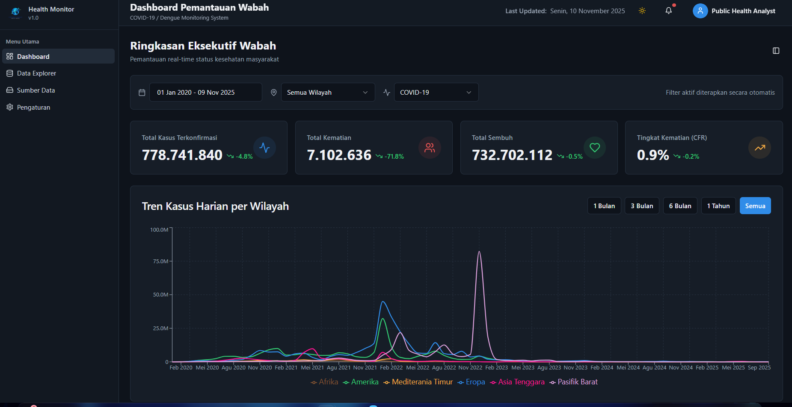
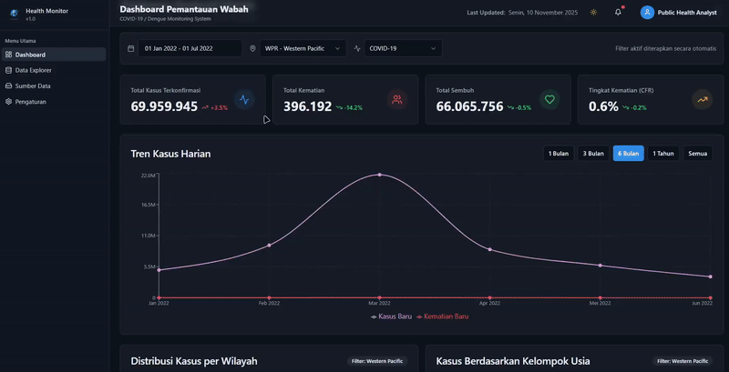
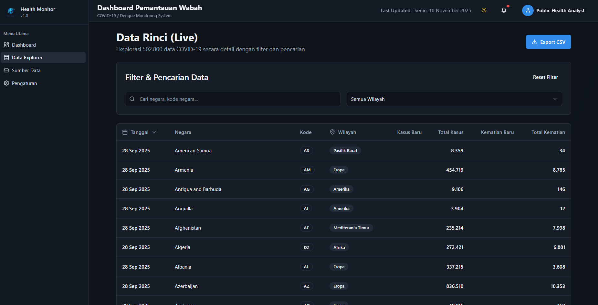
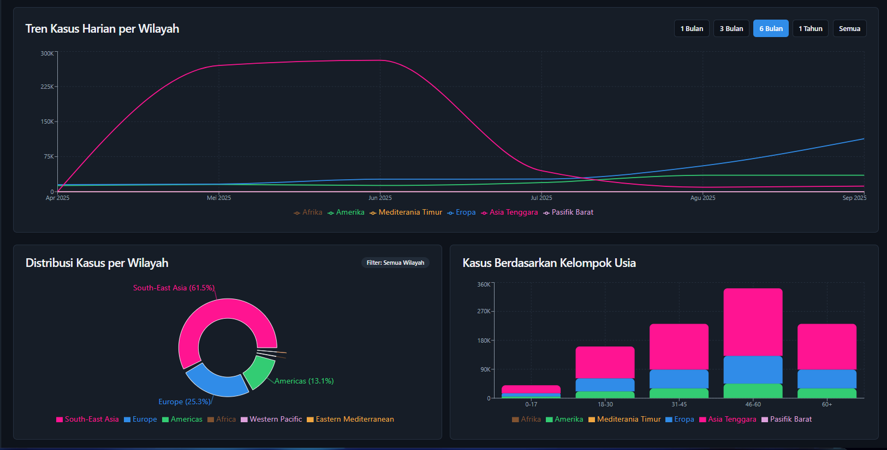
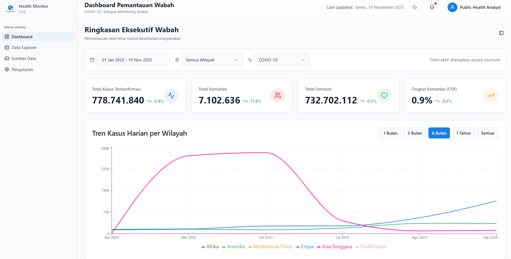

# Public Health Dashboard - COVID-19 Global Monitoring

<div align="center">


**Real-time COVID-19 Global Data Monitoring & Analytics Platform**

[Report Bug](https://github.com/FigoRazzan/Public-Health-Dashboard/issues) • [Request Feature](https://github.com/FigoRazzan/Public-Health-Dashboard/issues)

</div>

---

## 📋 Tentang Proyek

**Public Health Dashboard** adalah aplikasi web interaktif untuk memantau dan menganalisis data COVID-19 global secara real-time. Dashboard ini menyediakan visualisasi komprehensif terhadap tren kasus harian, distribusi regional, demografi umur, dan statistik kematian dari data resmi WHO (World Health Organization).

Proyek ini dikembangkan sebagai bagian dari mata kuliah **FB-499 INFORMATIKA TERAPAN BB** di Institut Teknologi Nasional (ITENAS) Bandung.

### 🎯 Fitur Utama

- **📊 Visualisasi Data Interaktif**
  - Tren kasus harian per wilayah dengan line chart
  - Distribusi kasus per wilayah WHO dengan pie chart
  - Analisis demografis berdasarkan kelompok usia dengan bar chart
  - Tabel detail data negara dengan sorting & pagination

- **🔍 Sistem Filter Canggih**
  - Filter rentang tanggal dengan date picker interaktif
  - Filter berdasarkan 6 wilayah WHO (Afrika, Amerika, Eropa, dll)
  - Time range selector (1 bulan, 3 bulan, 6 bulan, 1 tahun, semua)
  - Multi-mode visualization (per wilayah atau agregat)

- **⚡ Performa Optimal**
  - IndexedDB caching untuk loading instant
  - Load pertama ~10 detik, berikutnya < 1 detik
  - Memoization untuk optimasi re-rendering
  - Responsive design untuk semua device

- **📈 KPI Dashboard**
  - Total kasus terkonfirmasi
  - Total kematian dengan CFR (Case Fatality Rate)
  - Tingkat kesembuhan
  - Trend analysis 7 hari terakhir

## 👥 Tim Pengembang

Proyek ini dikembangkan oleh mahasiswa Informatika ITENAS:

<table>
<thead>
<tr>
<th>NRP</th>
<th>Nama</th>
<th>Role</th>
</tr>
</thead>
<tbody>
<tr>
<td>15-2022-044</td>
<td>Dimas Bratakusumah</td>
<td>Project Lead / Health Informatics Analyst & Ethics & Governance Representative</td>
</tr>
<tr>
<td>15-2022-064</td>
<td>Muhammad Figo Razzan Fadillah</td>
<td>Application Developer / Data Engineer</td>
</tr>
<tr>
<td>15-2022-150</td>
<td>Dian Raisa Gumilar</td>
<td>Data Analyst / Visualization Specialist</td>
</tr>
<tr>
<td>15-2022-217</td>
<td>Mochamad Ramdhan</td>
<td>System Architect / Developer</td>
</tr>
<tr>
<td>15-2022-250</td>
<td>R Jayani Maulana S</td>
<td>Public Health Data Specialist</td>
</tr>
</tbody>
</table>

**Mata Kuliah:** FB-499 INFORMATIKA TERAPAN BB  
**Institusi:** Institut Teknologi Nasional (ITENAS) Bandung  
**Tahun Akademik:** 2024/2025

## 📊 Sumber Data

Dashboard menggunakan dataset resmi dari:

- **Dataset:** WHO COVID-19 Global Daily Data
- **Sumber:** World Health Organization (WHO)
- **Format:** CSV (21.84 MB)
- **Jumlah Records:** 502,802+ rows
- **Periode:** 1 Januari 2020 - Present
- **Update:** Real-time data dari WHO

**Data Coverage:**
- 6 Wilayah WHO (AFR, AMR, EMR, EUR, SEAR, WPR)
- 200+ negara dan teritorial
- Data harian: kasus baru, kematian, kasus kumulatif
- Metadata: kode negara, tanggal pelaporan

## 🛠️ Teknologi yang Digunakan

### Frontend Framework & Library
- **React 18.3.1** - UI library
- **TypeScript 5.5.3** - Type-safe JavaScript
- **Vite 5.3.1** - Build tool & dev server
- **React Router 6.26.2** - Client-side routing

### UI Components & Styling
- **Shadcn/ui** - Komponen UI modern
- **Tailwind CSS 3.4.1** - Utility-first CSS
- **Radix UI** - Accessible component primitives
- **Lucide React** - Icon library

### Data Visualization
- **Recharts 2.14.1** - Chart library untuk visualisasi
- **TanStack React Query 5.59.16** - Data fetching & caching

### Data Processing
- **Papaparse 5.4.1** - CSV parsing
- **Date-fns 4.1.0** - Date manipulation
- **IndexedDB API** - Browser-side data caching

### State Management
- **React Context API** - Global state management
- **React Hooks (useMemo, useEffect)** - Performance optimization

### Development Tools
- **ESLint** - Code linting
- **PostCSS** - CSS processing
- **Autoprefixer** - CSS vendor prefixing

## 🚀 Instalasi & Setup

### Prerequisites

- **Node.js** >= 18.0.0
- **npm** atau **bun** package manager
- **Git**

### Langkah Instalasi

```bash
# 1. Clone repository
git clone https://github.com/FigoRazzan/Public-Health-Dashboard.git

# 2. Masuk ke direktori proyek
cd Public-Health-Dashboard

# 3. Install dependencies
npm install
# atau dengan bun
bun install

# 4. Jalankan development server
npm run dev
# atau dengan bun
bun dev

# 5. Buka browser di http://localhost:8080
```

### Build untuk Production

```bash
# Build aplikasi
npm run build

# Preview build
npm run preview
```

## 📱 Cara Menggunakan

### 1. **Filter Data**
   - Pilih rentang tanggal dengan date picker
   - Pilih wilayah WHO (atau "Semua Wilayah")
   - Klik tombol Reset untuk kembali ke default

### 2. **Analisis Tren**
   - Gunakan time range selector (1m, 3m, 6m, 1y, all)
   - Hover pada chart untuk detail data
   - Chart akan update otomatis sesuai filter

### 3. **Eksplorasi Data**
   - Mode "Semua Wilayah": Tampilkan breakdown per wilayah
   - Mode wilayah spesifik: Tampilkan data kasus & kematian
   - Gunakan tabel untuk melihat data per negara

### 4. **Optimasi Loading**
   - Load pertama butuh ~10 detik (download CSV 21MB)
   - Setelah itu, data di-cache di browser
   - Refresh page akan instant (< 1 detik)
   - Cache berlaku 24 jam

## 🎨 Fitur Visualisasi

### 1. Tren Kasus Harian per Wilayah
- **Multi-region mode:** 6 garis berbeda per wilayah
- **Single-region mode:** 2 garis (kasus & kematian)
- **Color coding:** Setiap wilayah punya warna unik
- **Format:** K (ribuan) dan M (jutaan)

### 2. Distribusi Kasus per Wilayah
- **Pie chart** dengan percentage
- **Smart labeling:** Hanya tampilkan label > 5%
- **Interactive tooltip** dengan format ribuan
- **Legend** untuk semua wilayah

### 3. Kasus Berdasarkan Kelompok Usia
- **Stacked bar chart** untuk multi-region
- **Single bar chart** untuk region spesifik
- **5 kelompok usia:** 0-17, 18-30, 31-45, 46-60, 60+
- **Color coding** konsisten per wilayah

### 4. KPI Cards
- **Real-time metrics** dengan trend indicator
- **Percentage change** 7 hari terakhir
- **CFR calculation** (Case Fatality Rate)
- **Icon indicators** untuk visual clarity

## 🔧 Struktur Proyek

```
Public-Health-Dashboard/
├── public/
│   ├── WHO-COVID-19-global-daily-data.csv  # Dataset WHO
│   └── robots.txt
├── src/
│   ├── components/              # React components
│   │   ├── ui/                  # Shadcn UI components
│   │   ├── AgeChart.tsx         # Bar chart kelompok usia
│   │   ├── DataTable.tsx        # Tabel data negara
│   │   ├── DistributionChart.tsx # Pie chart distribusi
│   │   ├── FilterBar.tsx        # Komponen filter
│   │   ├── KPICard.tsx          # KPI metrics card
│   │   └── TrendChart.tsx       # Line chart tren
│   ├── contexts/
│   │   └── FilterContext.tsx    # Global filter state
│   ├── hooks/
│   │   └── useCovidData.ts      # Data fetching & processing
│   ├── lib/
│   │   ├── indexedDB.ts         # Browser caching
│   │   └── utils.ts             # Helper functions
│   ├── pages/
│   │   ├── Index.tsx            # Dashboard utama
│   │   ├── DataExplorer.tsx     # Data exploration page
│   │   └── Laporan.tsx          # Report page
│   ├── App.tsx                  # Root component
│   └── main.tsx                 # Entry point
├── package.json
├── tsconfig.json
├── vite.config.ts
└── README.md
```

## 🌟 Highlight Teknis

### 1. **Smart Caching dengan IndexedDB**
```typescript
// Load pertama: Fetch & parse CSV
// Load berikutnya: Ambil dari IndexedDB (instant!)
const cached = await getCachedData();
if (cached) {
  console.log('Loaded from cache (INSTANT)');
  setData(cached.data);
  return;
}
```

### 2. **Performance Optimization**
```typescript
// Memoization untuk avoid re-calculation
const filteredData = useMemo(() => {
  return data.filter(/* ... */);
}, [data, filters]);
```

### 3. **Dynamic Visualization**
```typescript
// Chart berubah berdasarkan filter
{showMultiRegion ? (
  regions.map(region => <Line dataKey={`${region}_cases`} />)
) : (
  <Line dataKey="kasusHarian" />
)}
```

## 🖼️ Screenshots & Demo

### Dashboard Utama

*Dashboard dengan KPI cards, trend chart, dan real-time statistics*

### Tren Kasus Harian (Interactive)

*Visualisasi interaktif tren kasus harian per wilayah dengan multi-region comparison*

### Data Explorer

*Eksplorasi data dengan filtering, sorting, dan pagination*

### Visualisasi Interaktif

*Multi-region visualization dengan pie chart dan bar chart*

### Light Mode

*Tema terang dengan tampilan yang bersih dan modern*

## 🤝 Kontribusi

Kontribusi sangat diterima! Untuk kontribusi major:

1. Fork repository
2. Create feature branch (`git checkout -b feature/AmazingFeature`)
3. Commit changes (`git commit -m 'Add AmazingFeature'`)
4. Push to branch (`git push origin feature/AmazingFeature`)
5. Open Pull Request

## 📞 Kontak

**Repository:** [github.com/FigoRazzan/Public-Health-Dashboard](https://github.com/FigoRazzan/Public-Health-Dashboard)

**Institusi:** Institut Teknologi Nasional (ITENAS) Bandung

---

<div align="center">

**Dibuat dengan ❤️ oleh Tim Informatika ITENAS**

*Untuk Mata Kuliah FB-499 INFORMATIKA TERAPAN BB*

</div>
